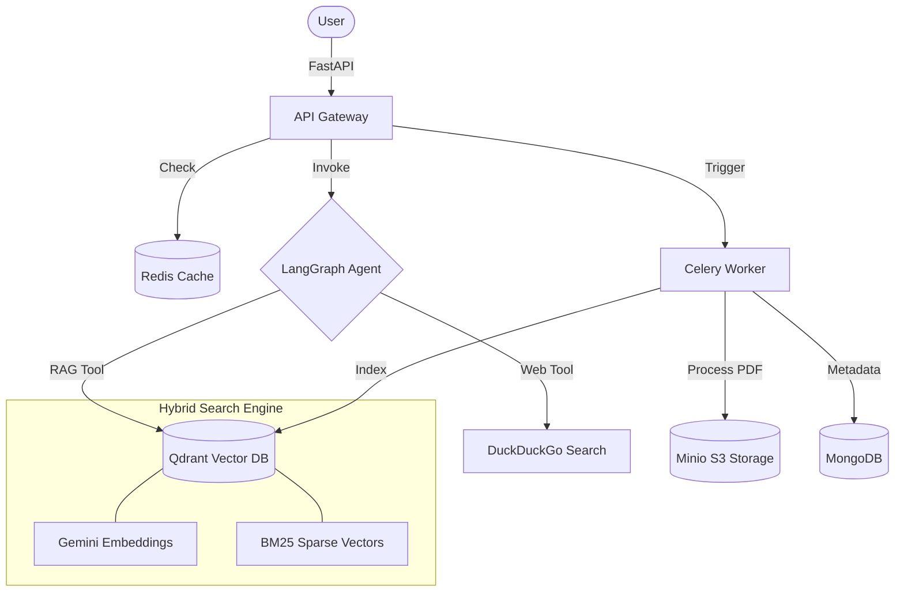

# 🧠 ManualMind: Agentic Document Intelligence & RAG System

**ManualMind** is a production-ready, agent-driven RAG (Retrieval-Augmented Generation) system built to transform static manuals and documents into dynamic, conversational knowledge bases. It leverages a sophisticated multi-stage reasoning architecture to provide highly accurate, context-aware answers by combining internal document retrieval with real-world web search.

---

## 🚀 Key Engineering Highlights (The "Why")

ManualMind isn't just a wrapper around an LLM. It's engineered for scale, precision, and cost-efficiency:

*   **🧠 Agentic Reasoning (LangGraph):** Uses a ReAct-style agentic workflow to decide whether to search internal documents, crawl the web, or answer from memory.
*   **🔍 High-Precision Hybrid Search:** Combines **Google Gemini Dense Embeddings** (semantic) with **BM25 Sparse Embeddings** (keyword matching) via **Qdrant** for superior retrieval accuracy.
*   **⚡ Intelligent Caching Strategy:** Implements a multi-layered caching system using **Redis** to bypass expensive LLM calls for frequently asked questions.
*   **🛠️ Production-Grade Scalability:** Decouples heavy document processing and long-term memory management using **Celery** background workers and **RabbitMQ/Redis** brokers.
*   **🛡️ Robust Document Pipeline:** Features an asynchronous ingestion pipeline with automated PDF parsing (PyMuPDF), batch embedding, and rate-limiting to handle large document sets gracefully.
*   **👁️ Observability & Tracing:** Integrated with **LangSmith** for full-trace debugging of agent reasoning paths and retrieval performance.

---

## 🏗️ Technical Architecture

ManualMind follows a microservices-inspired architecture containerized with Docker:



---

## 🛠️ Core Technology Stack

*   **Framework:** FastAPI (Python 3.10+)
*   **AI Orchestration:** LangGraph, LangChain
*   **LLM Providers:** Google Gemini (1.5 Flash/Lite), OpenAI (compatible)
*   **Vector Database:** Qdrant (Hybrid Search: Dense + Sparse)
*   **Databases:** MongoDB (Persistent Data), Redis (Cache & Session Memory)
*   **Object Storage:** MinIO (S3-Compatible)
*   **Task Queue:** Celery with Redis/RabbitMQ
*   **PDF Processing:** PyMuPDF (Fitz)
*   **Deployment:** Docker, Docker Compose, Makefile

---

## ✨ Features

### 1. Agentic Workflow (LangGraph)
Unlike linear RAG pipelines, ManualMind uses a graph-based state machine. The "Reasoner" node analyzes the user's intent and dynamically routes to:
- **`internal_manuals_tool`**: For proprietary knowledge stored in Qdrant.
- **`web_search_tool`**: For real-time updates when internal docs are insufficient.
- **Final Answer**: Synthesizing all retrieved data into a coherent response.

### 2. Scalable Ingestion Pipeline
Documents are uploaded to MinIO and processed asynchronously:
- **Automatic PDF Chunking**: Small, precise chunks for high RAG recall.
- **Batch Embedding**: Optimizes throughput for Qdrant upserts.
- **Rate-Limit Protection**: Smart sleeps between batches to respect Gemini API quotas.

### 3. Context-Aware Memory & Observability
- **Short-Term Memory**: Redis-backed session history for sub-second context retrieval.
- **Cold Memory Archiving**: Background tasks summarize and archive long conversations to prevent context window overflow and reduce token costs.
- **LangSmith Tracing**: Full transparency into agent decision-making. Every tool call, reasoning step, and retrieval result is traced for performance tuning and debugging.

### 4. Enterprise-Ready Security
- **JWT Authentication**: Secure endpoints for both API and WebSocket connections.
- **Role-Based Filtering (In Roadmap)**: Planned support for document-level permissions.

---

## 🚦 Quick Start

### 1. Prerequisites
- Docker & Docker Compose
- Google Gemini API Key

### 2. Environment Setup
Create a `.env` file from the provided template:
```bash
MONGO_URI=mongodb://mongodb:27017
MONGO_DB_NAME=manualmind
REDIS_URL=redis://redis:6379/0
QDRANT_HOST=qdrant
QDRANT_PORT=6333
MINIO_ENDPOINT=minio:9000
GOOGLE_API_KEY=your_gemini_api_key
```

### 3. Launch the System
```bash
# Using the Makefile for convenience
make build
```
The API will be available at `http://localhost:8000`. Access the interactive docs at `/docs`.

---

## 🛣️ Roadmap & Future Enhancements
- [ ] **Advanced Memory Archiving**: Summarizing long chat sessions to MongoDB for infinite-context retrieval.
- [ ] **RBAC (Role-Based Access Control)**: Document-level permissions for multi-tenant environments.
- [ ] **Frontend Dashboard**: A React-based interface for managing manuals and interacting with the agent.
- [ ] **Multi-Model Support**: Seamlessly switching between Gemini, Claude, and GPT-4o.

---

## 👨‍💻 Author
**[Nguyen Minh Triet Kieu]**

*Developed with a focus on scalable AI engineering and high-performance RAG architectures.*
